# IBM Data Science Capstone Project: SpaceX rocket stage 1 landing outcome
Developing a classification model for predicting whether or not SpaceX will successfully land stage 1 of a rocket for a given launch, to determine if the competitor SpaceY can compete against it.

## Quick Links
- Detailed overview of the project process: [Project Report](https://github.com/LucasHoffSchmidt/IBM_Data_Science_Capstone_Project_SpaceX/blob/main/Data_Science-SpaceX-Report.pdf)
- Jupyter Notebooks of the development process of the classification model: [Jupyter Notebooks](https://github.com/LucasHoffSchmidt/IBM_Data_Science_Capstone_Project_SpaceX/tree/main/Jupyter_Notebooks)
- Plotly Dash screenshots of launch results across launch sites and payload ranges: [Plotly Dash Screenshots](https://github.com/LucasHoffSchmidt/IBM_Data_Science_Capstone_Project_SpaceX/tree/main/Plotly_Dash_Screenshots)
- Other projects I have made: [Portfolio Website](https://lucashoffschmidt.github.io/)

## Technologies Used
**Tools and Platforms**
- Development: Jupyterlab
- Visualization: Plotly Dash, Microsoft PowerPoint Online.

**Libraries**
- Web Scraping: `beautifulsoup4` 
- Data Analysis: `pandas`, `numpy`
- Visualization:  `matplotlib`, `seaborn`, `folium`
- Machine Learning: `scikit-learn`
- Database: `sqlite3`
- Text Processing: `re`
- Formatting: `prettytable`
- Text Normalization: `unicodedata`
- Date and Time Handling: `datetime`
- Mathematical Operations: `math`
- File Handling: `io`
- Web Requests: `requests`, `fetch`
- Package Management: `piplite`

## Process
**Data Collection with API**
- Imported necessary packages (requests, pandas, numpy, datetime).
- Fetched rocket launch data using a static JSON URL.
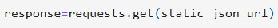

- Created a subset dataframe of the rocket launch data.
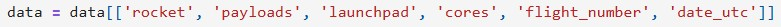

- Created empty list variables for the full launch dataframe.
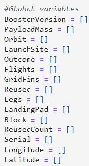

- Created helper functions to acquire specific data from the SpaceX API.
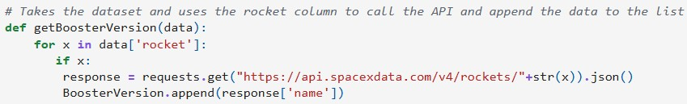

- Called the helper functions with the subset dataframe to create the full launch dataframe.
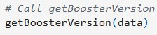

- Filtered the data to Falcon 9 launches.
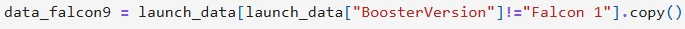

- Imputed missing values with the mean payload mass.  
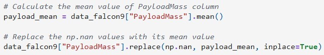  

**Data Collection with Webscraping**
- Imported necessary packages (requests, BeautifulSoup, re, unicodedata, pandas)
- Fetched and stored html from the falcon9 launch page in BeautifulSoup object
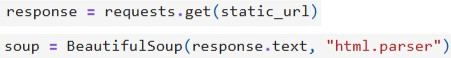

- Found and stored first launch table
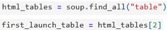

- Used helper function to extract table headers
- Used helper function to loop through the launch table, identifying rows that represented a valid flight number and extracting all launch details from that row into a dictionary
- Converted the dictionary to a dataframe

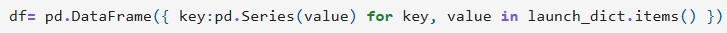  

**Data Wrangling**
- Imported necessary packages (pandas, numpy).
- Checked the percentage of null values for each column.
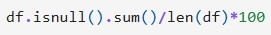

- Checked that datatypes were correct.
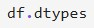

- Calculated the number of launches for each launch site, orbit type and landing outcome.
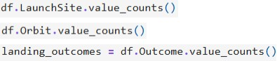

- Created a bad outcomes set.
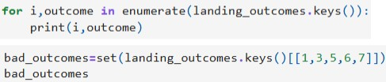

- Created a landing outcome list, specifying 0 for failed outcomes and 1 for successful outcomes and converted it into a dataframe column.
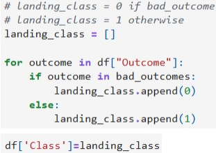

- Calculated the average landing success rate.

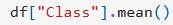  

**Exploratory Data Analysis with Pandas and Matplotlib**
- Imported necessary packages (pandas, numpy, matplotlib.pyplot, seaborn, fetch, io)
- Acquired rocket launch dataset from an URL
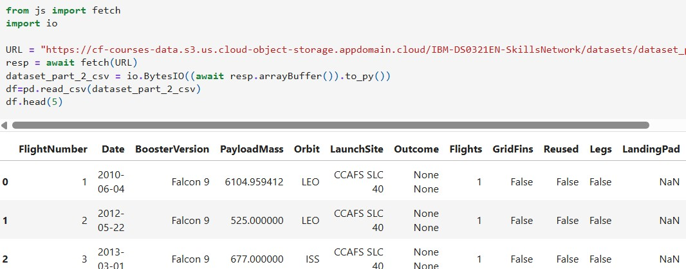

- Visualized relationships between the landing outcome and different features.
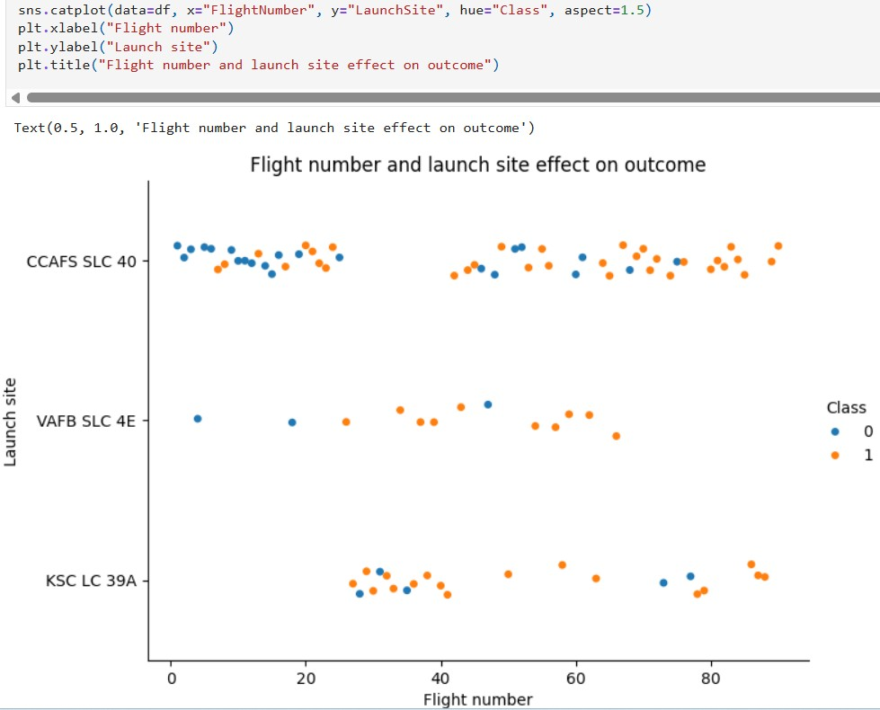
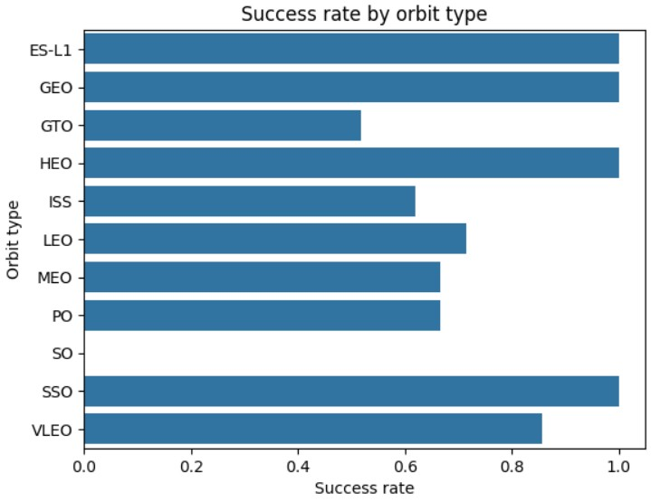

- Visualized the average yearly success rate.
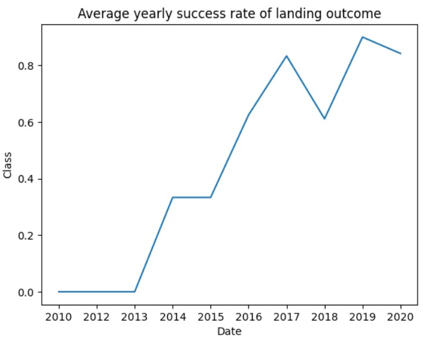

- One-hot encoded categorical columns (new binary column for each category)
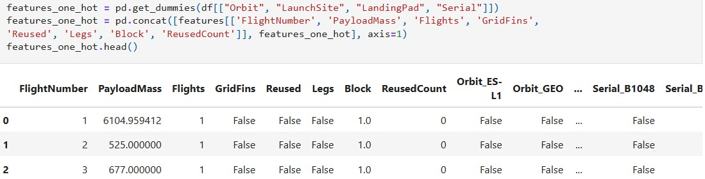

- Converted the data type of all columns to float (since all columns are numerical now)
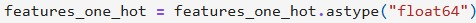  

**Exploratory Data Analysis with SQL**
- Imported necessary packages (sqlite3, prettytable, pandas)
- Acquired data and loaded it into an SQL table.
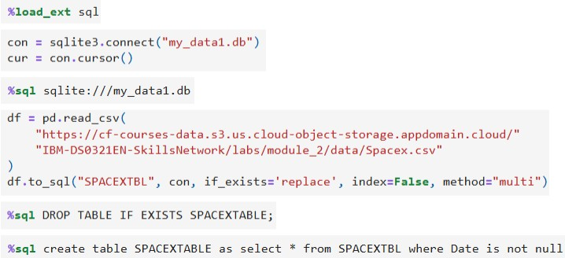

- Performed queries to explore the launch site data
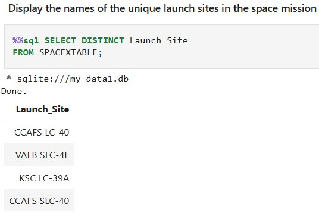
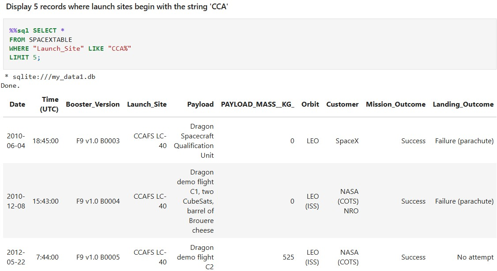
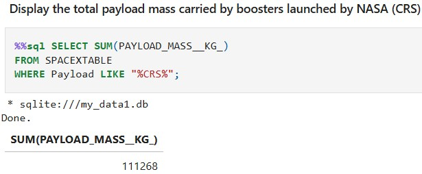
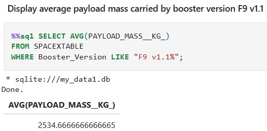
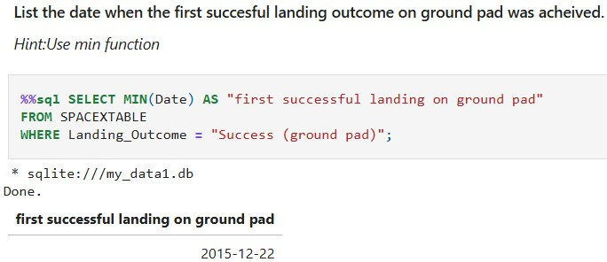
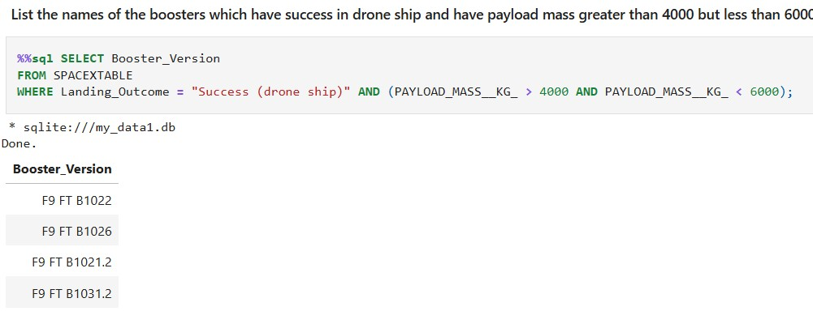
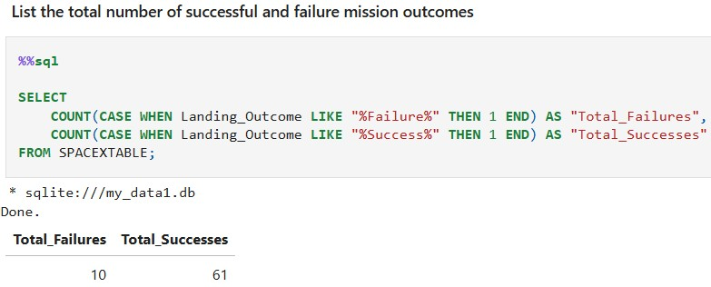
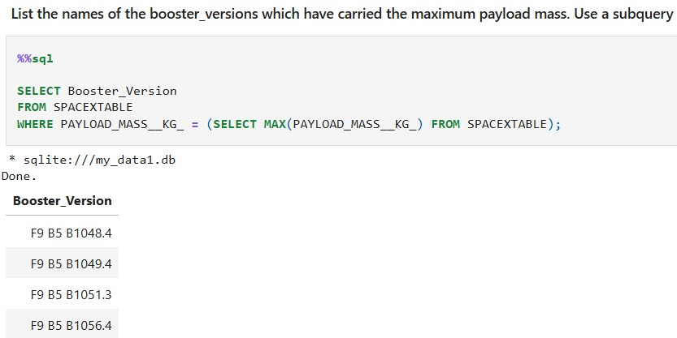
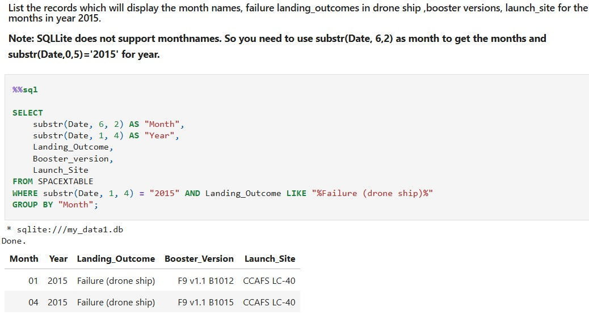
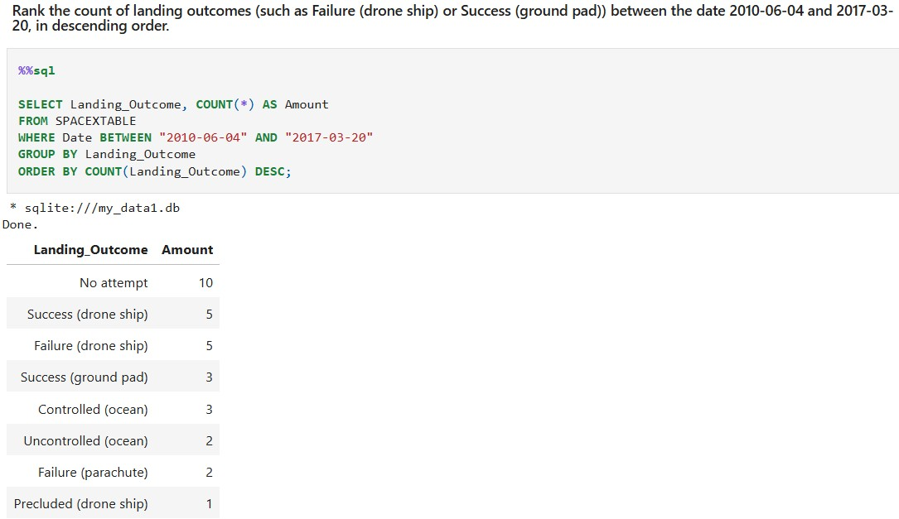  

**Interactive Visual Analytics with Folium**
- Imported necessary packages (folium, pandas, MarkerCluster, MousePosition, DivIcon, fetch, io, sin, cos, sqrt, atan2, radians)
- Generated a folium map centered at NASA Johnson Space Center with circle and marker icons for each launch site, indicating their location and name.
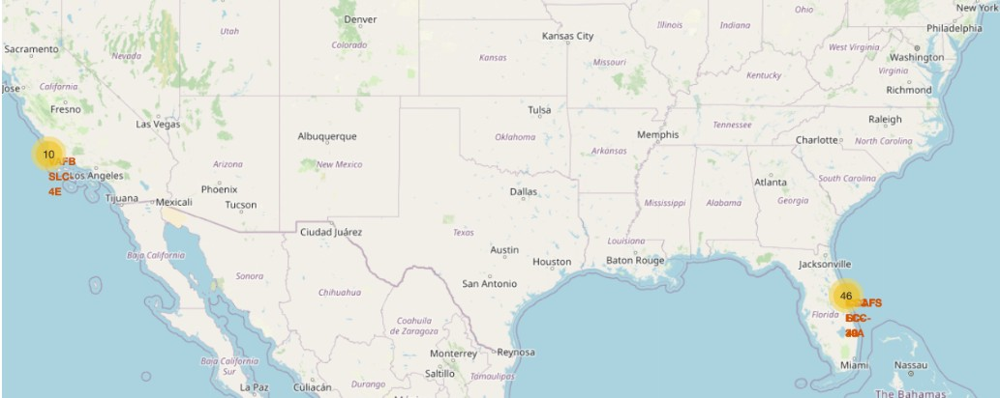

- Created red and green markers for success and failure for each launch of a launch site.
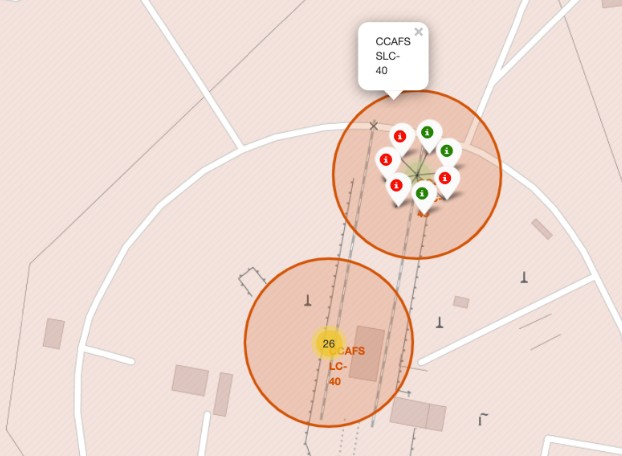

- Calculated the distances between each launch site and the nearest coast, railway, highway and city with lines and markers specifying the distance.

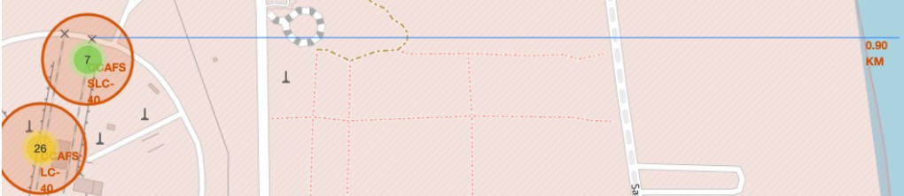  

**Model Training and Evaluation**
- Imported necessary packages (pandas, numpy, matplotlib, seaborn, preprocessing, train_test_split, GridSearchCV, LogisticRegression, SVC, DecisionTreeClassifier and KNeighborsClassifier)
- Loaded the original and one-hot encoded dataframes (for the y and X variables respectively)
- Created the target variable Y and standardized the features X.
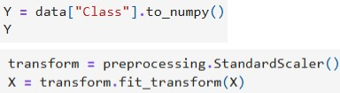

- Split the data into training and testing dataframes
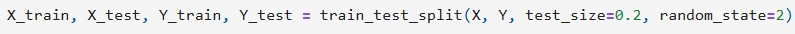

- Used gridsearch to find the best hyperparameters for different machine learning models, such as logistic regression
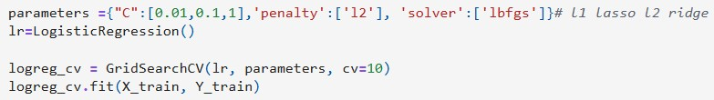

- Evaluated machine learning models by calculating their accuracy on the test data and plotting their confusion matrix.
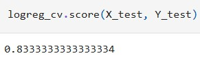
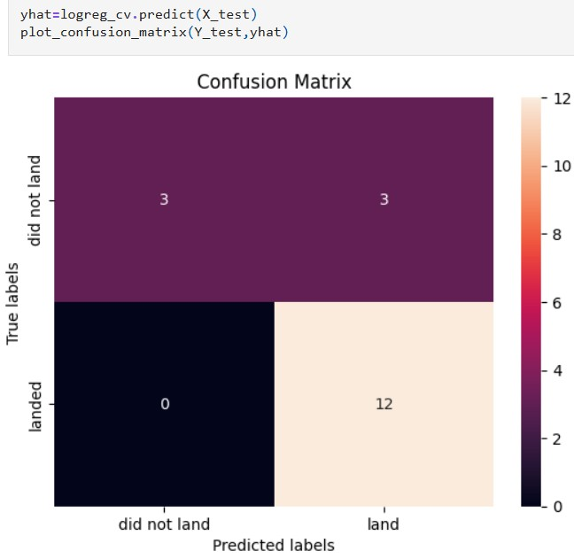

- Compared training and testing accuracy for the machine learning models
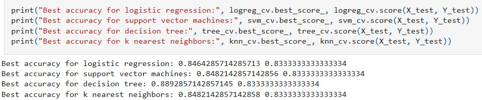  

**Plotly Interactive Visualization**
- Loaded the launch dataset with minimum and maximum payload
- Created a dash app layout
- Created a pie chart specifying the launch outcome for different launch sites
- Created a scatter chart specifying launch outcome for payload mass and booster versions  

## Insights 
- The highest chance of landing failure is at the landing site of CCAFS LC-40, a payload mass greater than 8000 kg, an orbit type of GTO or where the booster version is v1.1.
- The positive landing outcomes are increasing each year. 
- The launch site KSC has the highest success rate.
- All launch sites are close to the ocean and far away from cities.
- The booster FT has the most successful outcomes. 
- Each model has an accuracy of about 83% for the testing dataframe.
- The decision tree model has the highest accuracy for the training dataframe at almost 89%.

## Improvements
We used 83 features to train the models, so performing a more rigorous feature selection process to determine the very best features, may help to maximize the generalization capability of the models. 
